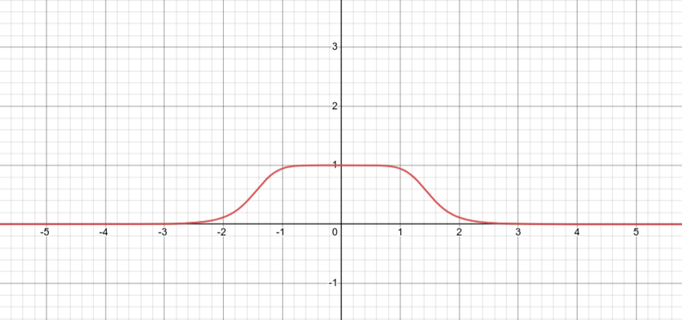

# Continuous Sparse Attention

Exploring the problem space of attention memory complexity, network meta learning, and sparsity with the proposal of a meta operator framework. The meta operator proposed, Ψ, takes a continuous embedding vector φ, and produces a function Φ which operates upon concrete data. For this to be useful in practice, the embedding φ must be continuous with respect to the output function space, and specifies the semantics of the output function, such as kernel size, stride, etc.

One can immediately see the utility of such a functional framework, if a case of the operator Ψ can be found. To optimize the network, one can backpropagate through the Ψ meta operator w.r.t. the loss to arrive at a more optimized model, the process of which may be orders of magnitudes more efficient than using reinforcement learning to explore the problem space. Additionally, the embedding vector φ can be treated as an ordinary embedding for prediction using traditional nlp models. Finally, near optimal sparsity may be achieved if the embedding φ is dynamically configurable w.r.t. inputs as well, since the attention span can be one such parameter within the embedding φ, which can be dynamically determined to lower the loss.

This repository contains the code for one case of the operator Ψ, which relies upon a soft-gate function and numerical inaccuracy, similar to [arXiv:1912.04427](https://arxiv.org/abs/1912.04427), to determine the attention width of K for each query Q. 

The softgate is implemented as
softgate(x) = 1 / (1 + abs(x / a) ^ b)

 [see desmos](https://www.desmos.com/calculator/grezgrefl4)

As one can see, the width of is continuous w.r.t. a and hardness w.r.t. b, where a and b are φ.

